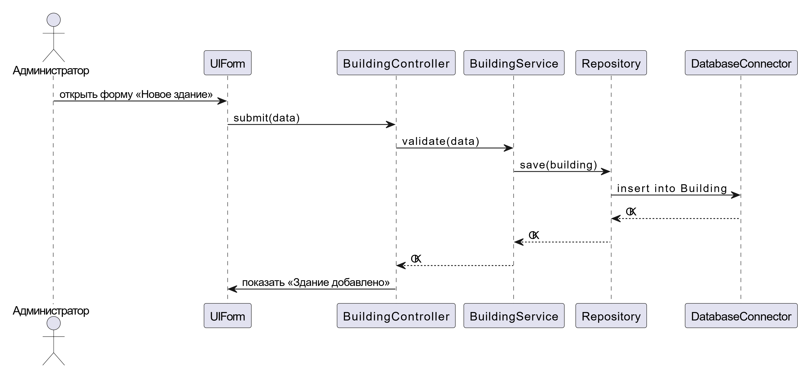

# Задание 2 из лабораторной работы 3
«Здание»: id, адрес; тип здания; количество этажей; количество квартир; срок 
эксплуатации; срок до капитального ремонта (70 лет - срок эксплуатации). 

---

## Диаграмма вариантов использования

<h3>Диаграмма вариантов использования</h3>

**Описание:**  
Диаграмма демонстрирует основные действия пользователя:
- Авторизация в системе
- Добавление здания
- Редактирование данных здания
- Удаление записи
- Просмотр списка зданий
- Формирование отчёта по капитальному ремонту

---

## Сценарий варианта использования: Авторизация

**Акторы:** Пользователь  
**Предусловие:** Пользователь открывает систему  
**Основной поток:**
1. Пользователь вводит логин и пароль
2. Система проверяет данные
3. При успехе — создаётся сессия, открывается главное меню
4. При ошибке — отображается сообщение об ошибке

---

## Диаграмма деятельности: Авторизация

<h3>Диаграмма деятельности — Авторизация</h3>

**Описание:**  
Диаграмма отражает процесс входа пользователя в систему и обработку случая с неверными данными.

---

## Диаграмма деятельности: CRUD-записи о зданиях

<h3>Диаграмма деятельности — CRUD-запись</h3>

**Описание:**  
Пользователь может добавлять, изменять, удалять или просматривать записи зданий. Система сохраняет изменения в базе данных и отображает уведомление об успехе/ошибке.

---

## Диаграмма классов

<h3>Диаграмма классов</h3>

**Описание:**  
- Класс `Building` содержит все свойства здания.
- `BuildingService` обрабатывает бизнес-логику.
- `Repository` отвечает за сохранение данных.
- `AuthService` — модуль авторизации.

---

## Диаграммы последовательности

<h3>Диаграмма последовательности — Авторизация</h3>

**Описание:**  
Пользователь взаимодействует с формой входа, которая передаёт данные в `AuthService`. После валидации система возвращает результат.

<h3>Диаграмма последовательности — CRUD-запись</h3>

**Описание:**  
При работе с записями здания пользователь отправляет запрос через UI, который передаётся через `BuildingController` → `BuildingService` → `Repository`, где происходит взаимодействие с базой.

---

## Диаграмма компонентов

<h3>Диаграмма компонентов</h3>

**Описание:**  
Система разделена на модули:
- Web-клиент (`HTML/JS App`)
- Backend API (`AuthController`, `Building Controller`, `Building Service`, `UserService`)
- Слой данных (`Repository`, `Database Connector`, СУБД)
- Документация (`API Docs`, `UML Diagrams`)

---

## Заключение

Разработанная спецификация охватывает ключевые аспекты системы и может быть использована как основа для реализации проекта. Все диаграммы построены с использованием стандартов UML и отражают поведение, структуру и взаимодействие компонентов системы.
